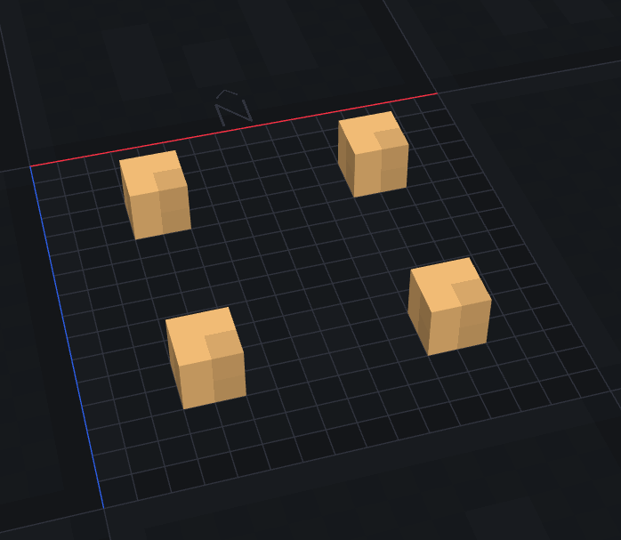
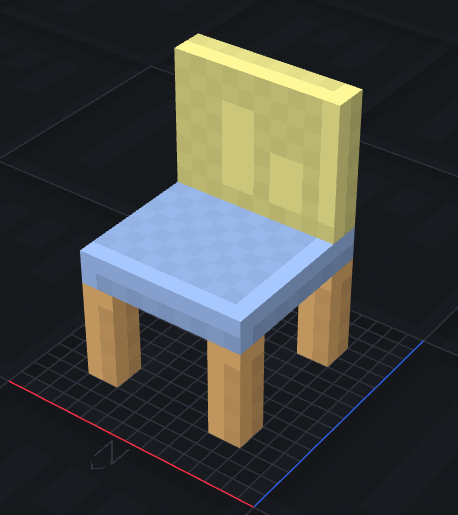
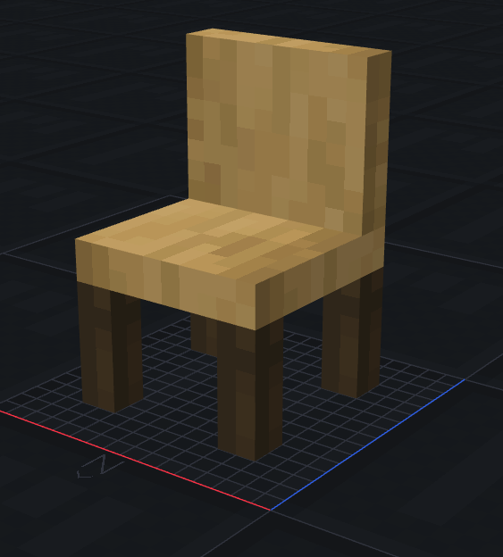
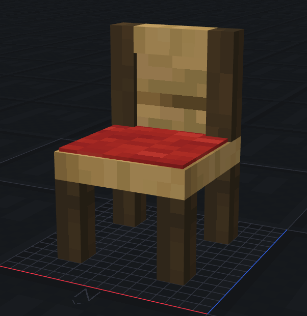
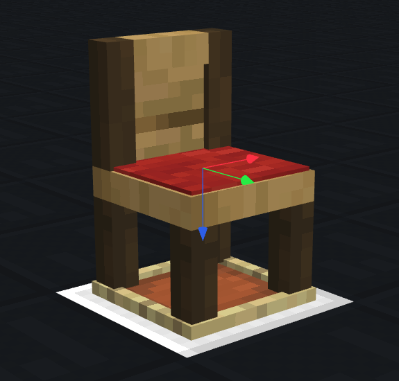
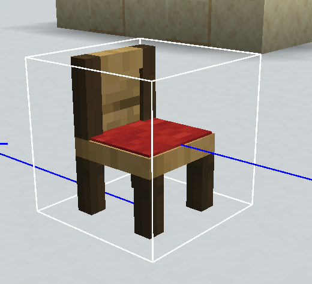

Resource Packs - 3D Models and Advanced Implementation
----------------------------------------

This page will provide some examples and guides to how to utilize the program Blockbench to create custom 3D items for use in your own projects.
This guide will assume you already have a basic resource pack file structure, but will instead it will primarily focus on the step by step process of creating a model using Blockbench, creating a namespace, and finally implementing it using Denizen with up to date info for modern Minecraft verisons.

```eval_rst
.. contents:: Table of Contents
    :local:
```

### Namespaces and Filepaths

Assuming you already have a basic resource pack with an `.mcmeta` file and an `assets` folder, inside the `assets` folder is where all of your `Namespaces` live. A `Namespace` is a kind of directory that Minecraft uses to organize resource and data packs.

For example, all of the Minecraft textures and models will be prefixed ingame with the following Namespace `minecraft:wooden_sword` . 

You can see the namespace being the first part before the colon, being `namespace:item`. In the above, it sees the `minecraft` part being the folder it needs to look for in the Resource Pack. 

You can easily create your own namespace by simply making a new folder under the `assets` directory. We'll be using the namespace of `example` for our purposes today.

Your filepath will look like this: `.minecraft/resourcepacks/ResourcePackName/assets/example`

The reason you would want to use your own namespace is mostly organizational, since otherwise all of your custom models would be located in the `minecraft` namespace folder, which could get confusing when trying to debug issues. 

Another bonus to using a namespace is that you are not limited to just one new namespace. You can have multiple, which is useful for organizing different modules or different projects on your server.

You could have one for `fishing:new_fishing_rod` while also having `furniture:oak_chair`. 

Or even if you are sharing a resource pack with other team members, `talfein:hamburger` and `nicism:workbench`.


Namespaces can also have subdirectories inside, which allows for even further organization. One example of this is by separating different models depending on their type or usage.
- `cooking:ingredients/butter`
- `cooking:food/bacon_cheeseburger`

You can do this by creating a folder inside the `Items` folder.

You'll end up with a filepath of: `.minecraft/resourcepacks/ResourcePackName/assets/example/items/subfolder`

Namespaces are comprised of the simple file structure:
- Items - What is registered to Minecraft
- Models - What is referenced in the Items folder
- Textures - What is referenced for texturing in the Models folder

#### Items Folder

This folder is where all of your items are registered by Minecraft, as well as items. The `.json` files inside this directory are the exact names of what will be registered in-game for usage in your custom items.

If you create a file in the folder called `hamburger.json` you will end up with registering an item with the namespace key of `example:hamburger`.

Keep in mind that this `.json` file can actually be called something else than what your model file is called.
For basic models, it's a good idea to reuse the same name for your model so you don't get confused easily.

##### Example file `new_model.json`

Here is what the inside of a most basic `.json` file looks like in the Items folder:

```json
{
   "model": {
   "type": "minecraft:model",
   "model": "example:new_model"
   }
}
```

You can see that it points the `model` key towards the `example:new_model`. With the `new_model` being the `.json` file for our model located in the `models` directory.

#### Models Folder

This folder houses all of the direct model files that is exported by Blockbench or other programs you might use.

This directory can also have subdirectories, just like the `Items` folder can.
For example:
- `*/example/models/tools/steel_pickaxe.json`
- `*/example/models/ingredients/fish_bait.json`

Just be sure to properly reflect the subdirectory in the `.json` file in the relevant `Items` file.

#### Textures Folder

Finally, this folder houses any of your custom textures used in your model files.

An important thing to note is that since the `1.21.2` update, model atlases have been given a strict enforcement that you cannot cross-use subdirectories.

So if you wanted to use a directory of `*/example/textures/block/`, you would need to use only textures from the `block` directory; you cannot use textures from an `item` directory. Supposedly, this is for optimization for the GPU engine for baking. (Personally, it's extremely annoying since this wasn't a solid rule for a solid decade)

### Blockbench

Time to make some models.

For this tutorial, we'll be doing a step-by-step simple guide to make a model using Blockbench.

You'll want to install Blockbench by following the link to the [official website](https://www.blockbench.net/downloads) and installing it properly, following the instructions provided by the installer.

#### Creating a Model

To get started making a model for Java Minecraft that will be used by your Resource Pack, click `File` at the top toolbar, then select `New`.

Specifically select `Java Block/Item`. Otherwise, the Blockbench exporter will not produce a `.json` file recognized by Minecraft.

You will want to enter the `File Name` section with the name of your model. This will directly provide the output file with the correct name.

`IMPORTANT NOTE`: Do not use any capitalization or spaces in the file name. Minecraft files only rely on alphanumeric characters and underscores. `(A-Z, 0-9)` 
If you want to separate your words, use an underscore (_) in your file name.

For our guide, we'll be making a chair for use in furniture with an associated Denizen script later on to implement it directly in-game.

If you wish to follow along, name your model `fancy_chair`

Once you have your model started, you will be left with an empty plane. 

#### Cubes

To add anything onto your model, you will need to add a `Cube`. These are the direct building blocks that make up any model.

Navigate over to the `Outliner` on the right side of the program. This is the table of contents, where you can easily select any cubes or groups you may have.

However, you currently have no cubes or groups. To add one, select the `Plus Symbol` to add an `Element`.

This will place a `2 x 2 x 2` cube into the model. 

The default size that Minecraft allows to fit in a single block's space is '16 x 16 x 16`. So keep this in mind if you want your model to fit well with what you plan to use it for.

You can name each of the cubes you have by `Right Clicking` it in the `Outliner` and selecting `Rename`. The default keybind for this is `F2`.

#### Groups

For organizational purposes, `Groups` are very useful, so you don't end up with your model entirely composed of parts called `Cube` and not knowing what goes where.

To create a group, select the `Folder` icon next to the `Plus` symbol. You will likely want to put your original Cube inside this Group by dragging the Cube in the `Outliner` onto the newly created Group.

By selecting the Group, you also select any Cubes inside. This can make it easy to move the entire selection around in your model to readjust where something goes.

For our purposes, we'll be making a Group called `legs`. 

Create four separate cubes in this Group and position them equidistant from each other in the corners of the model.



#### Facing the Right Way

Now that we have the start of the legs of our chair, we'll want to keep in mind the direction our model will face for our use. If you design your model to face `North`, then when you place it down in the world, keeping in mind the player's facing direction, it will face outwards and away from the player as intended. 

This is important so you do not end up with a model facing the wrong direction when it comes to your usage. However, this is entirely on a case-by-case basis; if it does not matter what direction your model will be seen from, then simply ignore this.

#### Resizing

To fully make the legs of our chair, you will want to lengthen the cubes. To make this a simple model, we'll be using increments of `2 Voxels` each. We now have our chair legs with a size of `2 x 6 x 2`

This length is important because we'll want to create a new group called `Seat` and add a cube to it to place on top of our legs. And since this new seat is `2 Voxels` thick as well, our model now has a total height of `8 Voxels`.

`8 Voxels` is also the same size as a slab in Minecraft. Which is also exactly the height at which most `Sit` or `Mount` mechanics in Denizen place the player at. 

We'll now want to make a new group called `back`; this will be the back of the chair. Add a cube to this new group.
Making this also `8 Voxels` in height means we now have a total height of `16 Voxels`, which is the max height of a standard Minecraft Block.



#### Texturing

Now that we have a model, we could technically export this to our resource pack and continue with the guide, however there is no textures on the model. It will show up in-game as black and purple checkerboard.

To add textures to your model, you will want to import some from the `Textures` section on the left pane of the program.

This is where, if you have any art skills, you can create your own texture UV maps for your model, but the easiest thing you can actually do is just to reuse vanilla Minecraft's textures.

This means that you don't have to be skillful at art to create your own custom 3D models.

However, you will likely want to extract all of Minecraft's Textures for your usage.

##### Getting Textures

There are a few hosted copies of Minecraft's textures online, but the easiest way to obtain them is to extract them yourself.

Follow this step-by-step process:
1. Locate your `.minecraft` folder
2. Enter the `versions` folder
3. Locate your current Minecraft Jar, like `1.26.2.jar`
4. Use an extraction program like `7-ZIP` to extract the jar to your desired directory
5. Navigate to the `Textures` folder

It might be a good idea to pin this folder to Quick Access so you can grab it quickly later.

##### Applying Textures

Now that you have the textures folder, you will want to import it into Blockbench. On the `Textures` section, select `Import a Texture`. This will open your file browser. You'll want to find where you stored your Minecraft textures.

`IMPORTANT NOTE`: Reminder, due to the `1.21.2` update, you cannot cross the atlases for textures. So if you want to use textures from the `Blocks` folder, you cannot also use textures from the `Items` folder.

A few textures we will use for this project are as follows:
- `stripped_oak_log`
- `stripped_dark_oak_log`

The easiest way to apply a texture is simply by dragging the texture from the side directly to the Cube you want to texture. This will place the texture onto the single face of the Cube. 

This may take a while and be tedious to apply for each face of the Cube; an easier way exists: hold `SHIFT` when you let go of it. This will apply it to all faces of the Cube.



##### UV Mapping

You can move the UV of each face of your texture by moving the selection boxes in the `UV` section above `Textures`. 

This allows you to grab certain bits of the texture for your model for uses like:
- Connecting Wood Grains
- Grabbing interesting parts
- Forming solid pieces out of multiple cubes

##### Detail Work

Now that we have a solid, simple model, we can get a bit fancy or fix any issues that arose.

Let's try adding a cushion to the chair by selecting the seat and copying it. You now have a second cube of the same size. 

Move it up `2 Voxels` so it's on top of the seat. 
Select the `Resize` tool and shrink it down to `9.5 x 0.25 x 7.75`
Center it in the seat by adjusting its position.

We now have a cube slightly raised from the seat. Import the texture `red_wool` and apply it to all faces. This gives us a nice cushion for the seat. 

We can do something similar to the back end by using additional tools.

Select the `Knife` tool and click on the back.
Cut it `Horizontally` to split the Cube into two sections.
Repeat it `Vertically` on the new bottom sides.
Select the new `Middle` section of the back.
Shrink it inwards so there's now a depression in the backrest.

You can also `Retexture` the new edges of the backrest in a different wood to give the chair a more visual edge.



#### Display

Another important thing to consider is how the model will be rendered to the player, either in the Inventory or in the player's hands.

This is where the `Display` tab comes into play. A lot of this involves tweaking the model's scaling to fit well in the player's hands or GUI. 

A useful tip is that you can often simply select `Copy` and `Paste` to swap it between hands. You can also create a `Preset` to make applying similar adjustments to other models in the future.

#### Cleanup

This is all good and all, but we want to make sure our new model is optimized for players to use in their builds without causing too much lag.

An easy way to do this is to cull any faces that players will not see. 

To do this, you can select any cube that has a face that players cannot see. 

For example, our chair legs. The tops of the legs won't have any way for players to see. Select the legs group and on the `UV Map` sidebar select `Up`. Press the `X` button at the bottom of the sidebar to `Remove Face`

Repeat this for any other cubes with hidden faces to improve your model's performance.


#### Exporting

Now we have our cleaned-up and ready model for Minecraft. We can now export this to our resource pack folder by going to `File` at the top of the program. Select `Export` and export it as `Block/Item Model`.

This will bring up your file explorer and ask you where to save the new model. Navigate to the namespace you created and save it in the `models` folder. 

We now have a proper model saved; however, we will want to make sure we have a relevant `items` file for our new model so it can be used properly in-game.

```json
{
   "model": {
   "type": "minecraft:model",
   "model": "example:fancy_chair"
   }
}
```

Copying the above should suffice, as we have the file name the same as when we exported it.

### Denizen

We now have a model and a resource pack with the model registered, and we plan to use it in-game for our project.

Implementation can go in quite a few different ways. Still, we will want to register this directly as an item through Denizen so that players can hold it.

```dscript_green
fancy_chair:
    type: item
    material: brick
    display name: <white>Fancy Chair
    mechanisms:
        item_model: example:fancy_chair
```

Using the Denizen Mechanism `item_model`, we can directly set the item model to the one we registered in our resource pack above. 

It's simply that easy to get your model in-game. No need to fight with data packs or item components. 

You'll likely want to create a way to obtain your item, such as a `recipe` or a custom `shop` using villagers or other methods.

However, we want our model to actually be usable or show up in-game as a decoration.

#### Item Frame

You can simply modify the `Item Frame` display in Blockbench to an upright position so you can just place the item directly into the item frame as a decoration. The only downside is that the item frame is visible and entirely static.



We can do even better... Using Denizen!

#### Item Display

By utilizing `Display Entities` like the `Item Display,` we can directly achieve spawning the model into the world without relying on an item frame.

These also don't even rely on any of the Blockbench `Display` changes, and instead, it's your direct model you made in the world. 

This works with spawning vanilla items as well and makes great decorations on its own.

The only problem is that we can't interact with these as a player. There is simply no hitbox for the `Item Display` for the player to click or break.

These also tend to be difficult to remove just by targeting them with `<player.target>`, since you have to look at their origin point. You can see it by using `F3 + B` to show hitboxes. It's very precise.

However, we can simply `flag` this item to keep track of it. By flagging something with this `Item Display` we can directly target it for removal to clean it up or modify it in any way.

To spawn an item display, you can create an entity script like:

```dscript_green
chair_model:
    type: entity
    entity_type: item_display
    mechanisms:
        item: fancy_chair
        scale: 1,1,1
```

Changing the `Item` mechanism directly changes the model of the `Item Display`. This can be either any vanilla item or a direct `Item Script` from Denizen.

Using the `Scale` mechanism changes the item's size in the world. It defaults to `1,1,1`; I provided it above just to see how it's formatted.

#### Interaction Entity

How about we add an actual hitbox to this `Item Display` so players can interact with it?

`Interaction Entities` provide a modifiable hitbox based on the `Height` and `Width` mechanisms, both of which default to `1`. 

It's important to know that `width` is a radius around the middle, which is unfortunate for making rectangular hitboxes in a single horizontal direction.

```dscript_green
chair_interaction:
    type: entity
    entity_type: interaction
    mechanisms:
        height: 1
        width: 1
```

#### Putting It Together

We have both our `Interaction Entity` and our `Item Display`, and we want to combine the two for our purposes.

If you use an `Event Script` to listen for the player right-clicking the interaction, we can have the player sit directly on the chair.

```dscript_green
chair_event:
    type: world
    events:
        on player right clicks chair_interaction:
        - mount <player>|<context.entity.flag[chair_model]>

        on player damages chair_interaction:
        - remove <context.entity.flag[chair_model]>
        - remove <context.entity>
```

By using the `Mount` command, we can force the player to sit directly on the model, which, as explained above, places the player as if they were on a slab. 

We also wanted to keep in mind a cleanup method to remove the chair's entity and model.



### Closing Notes

Using Blockbench isn't that hard, and you can implement your own models directly in-game by utilizing the power of Denizen.

It all depends on your creativity and logic in how you want to utilize custom models. 

A few examples from systems that I've created:
- Crops using 3d crop models
- Furniture System
- 3D Tools
- BreweryX Replacement by using 3D Barrels
- Custom Crafting using 3D workbenches and stations
- Fishing using 3D nets and traps

If you have any questions or ideas you would like help with, feel free to make a support thread on the Denizen Discord!

### Related Technical Docs And Links

* [Blockbench Downloads](https://www.blockbench.net/downloads)
* [7-Zip Downloads](https://www.7-zip.org/download.html)